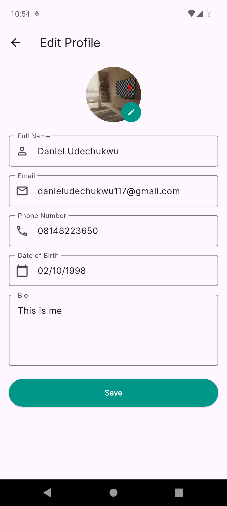
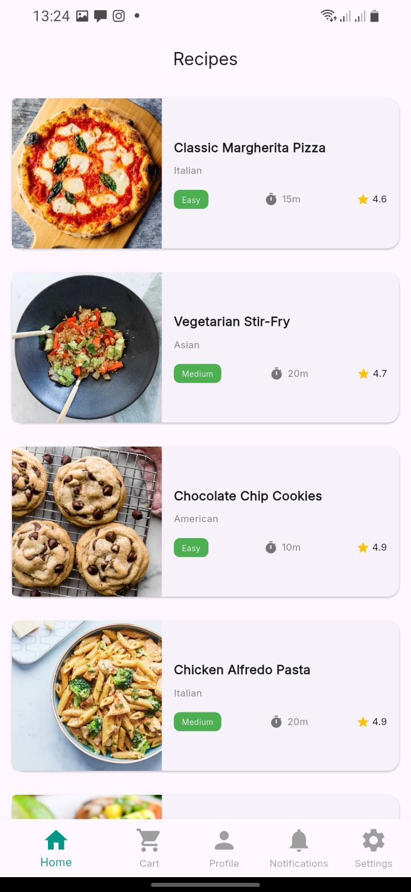

# Book'n Eat

This is a recipe app that lists and displays recipe of different meals. Currently still in development, I'm working my way up.

## NB: I exceeded my free plan for the other account, so I uploaded to another account. Here's the link: https://appetize.io/app/b_mrodeeju5koqfli34fndirew7q

## New Implementations

- **Profile Screen** - Fixed the bugs in the provided codebase and added it to my app,
- **Edit Profile Screen** - Worked on the edit profile page too, and made data persistent accross sessions,

## How to Run

1. Clone my repository - https://github.com/sudo-thanos/KodeCamp_Flutter/tree/main/stage%206/bug_fixes
2. Install dependencies:

```bash
   flutter pub get
```

3. Run the app:

```bash
   flutter run
```

4. If you have an android phone connected wirelessly or wired, `flutter run` will detect the device and build and run on it.
5. if not, run

```bash
   flutter run -d linux (if you use linux like me).
```

## UI Design Choice

Still following the same design concept of the main app, but used Ai to spice things up a bit. I think I'm loving how this app is coming together. I'm proud!!

I think i'm starting to like less rounded corners though. I might change all the borderRadius accross board.

## Screenshots




<!--  -->
